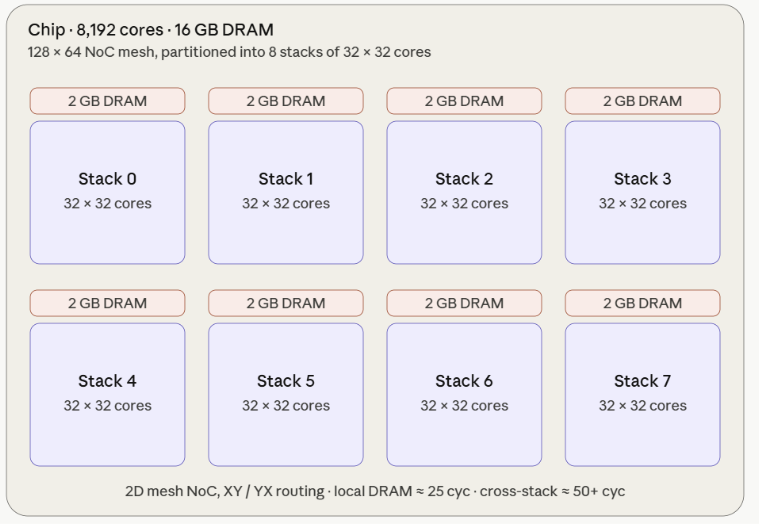
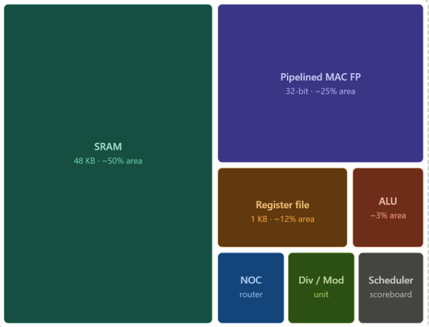
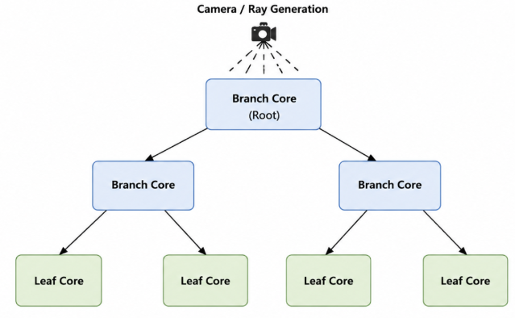
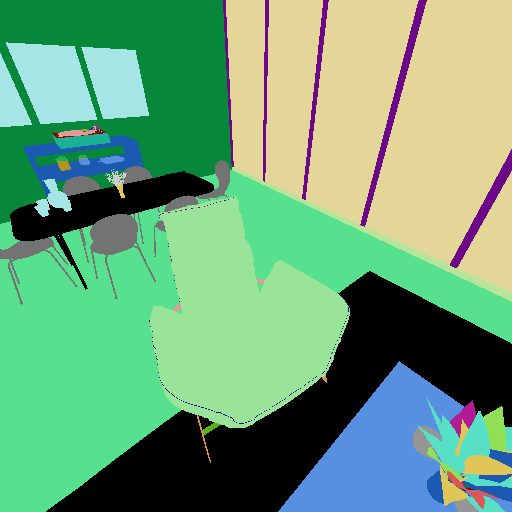
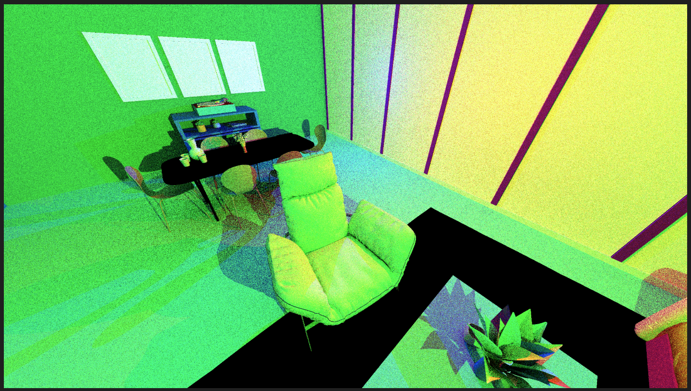
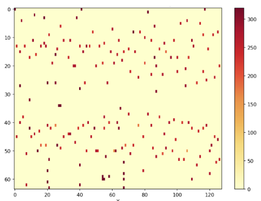
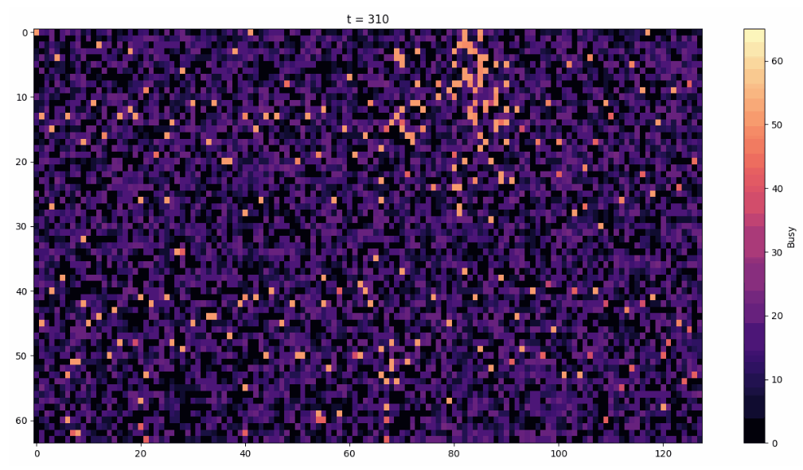
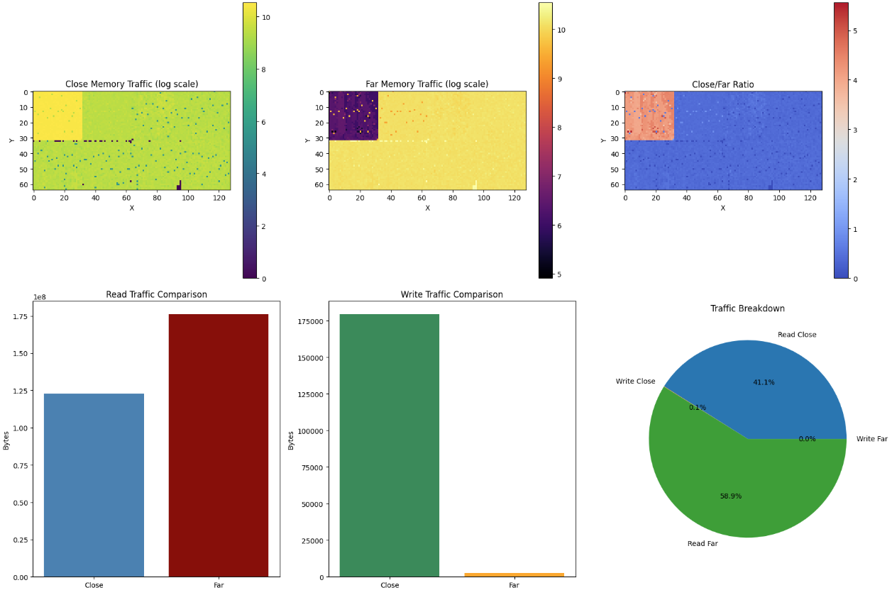

# DRÆM: Distributed Ray-Accelerated Engine through MIMD

*A tiled MIMD accelerator architecture for hardware ray tracing, its cycle-accurate Rust simulator, and the full toolchain (BVH partitioner, custom assembler, CUDA baseline, and telemetry visualizer) built to evaluate it.*

**Alexander Gallagher · Saipranav Venkatakrishnan · Ryan Horstman**, University of Illinois Urbana-Champaign, ECE 511, Spring 2026

This project designs, from scratch, a full alternative hardware architecture for ray tracing, then proves it out end to end instead of just describing it on paper. We built a cycle-accurate multithreaded simulator in Rust that models 8,192 independent MIMD cores arranged in a 128×64 mesh across 8 DRAM stacks, each core carrying its own 48 KB SRAM, 16 hardware thread contexts with scoreboarded register readiness, a pipelined FP32/FP16/FP8 datapath, and a NoC router, all synchronized cycle-by-cycle across parallel OS threads with a real barrier. To actually run programs on that chip, we designed a custom 32-bit instruction set from the ground up and wrote a two-pass assembler for it in Rust, then hand-wrote roughly 4,500 lines of firmware in that ISA implementing the full ray lifecycle: BVH subtree download, AABB traversal, ray forwarding across the mesh, shadow and bounce ray spawning, and pixel accumulation, including a from-scratch deadlock-avoidance protocol for the ray-forwarding graph and a dynamic core-cloning mechanism for runtime load balancing. On top of that we built a BVH preprocessing pipeline that imports OBJ scenes and partitions the hierarchy across the simulated mesh using spectral embedding and simulated annealing to minimize on-chip wire length, a telemetry pipeline that exports per-cycle NoC congestion, DRAM traffic, and core utilization for visualization, and an independent, hand-optimized CUDA path tracer used as a rigorously profiled GPU baseline (validated on real hardware via Nsight Compute and cross-checked against an AccelSim RTX 3090-class model) to argue the case against SIMT quantitatively rather than by assertion. The result is a working simulator that boots real firmware, loads real geometry, executes real ray traversal, and reproduces the exact load-imbalance signature the architecture predicts, all built and debugged by a three-person team in a single semester.

📄 [Read the full paper](docs/ECE511_Project_Paper.pdf) for the complete methodology, related work, and citations. This README summarizes it and documents how the code in this repo maps to it.

---

## Table of contents

- [Overview](#overview)
- [Why GPUs struggle with ray tracing](#why-gpus-struggle-with-ray-tracing)
- [The DRÆM architecture](#the-dræm-architecture)
- [Repository layout & the end-to-end pipeline](#repository-layout--the-end-to-end-pipeline)
- [Building and running](#building-and-running)
- [Results](#results)
- [Project status](#project-status)
- [Team & contributions](#team--contributions)
- [Related work](#related-work)
- [Third-party code](#third-party-code)
- [License](#license)

---

## Overview

Modern GPU ray tracing is bottlenecked by the SIMT execution model itself, not by a lack of fixed-function hardware: per-ray BVH traversal paths diverge, causing warps to serialize; BVH traversal is a pointer-chasing access pattern that defeats caches built for spatial/temporal locality; and load across rays is inherently unbalanced. Dedicated RT Cores accelerate the intersection math but don't fix any of these three structural problems.

**DRÆM** is a proposed alternative: a 2D mesh of thousands of simple, deeply-multithreaded MIMD cores, each holding a private slice of BVH geometry in on-chip SRAM. Instead of grouping rays into warps and stalling on divergence, DRÆM turns traversal into an explicit message-routing problem: a ray is a message that hops across a Network-on-Chip (NoC) to whichever core owns the next relevant piece of the BVH. This:

- eliminates warp divergence by construction (there is no warp),
- removes DRAM from the traversal critical path (every intersection test reads from local SRAM), and
- turns load imbalance into a distributed scheduling problem that the architecture can respond to dynamically (idle cores can clone a busy core's firmware and geometry).

This repo contains the full stack we built to evaluate that idea:

1. A **BVH preprocessing pipeline** that imports an OBJ scene, builds a BVH, and partitions it across an 8,192-core mesh.
2. A **custom two-pass assembler** for DRÆM's hand-designed 32-bit ISA.
3. A **cycle-accurate multithreaded Rust simulator** of the full chip: 8,192 cores across 8 DRAM stacks, NoC routing, per-context register scoreboarding, the works.
4. A **CUDA baseline** ray tracer, profiled on real hardware and through AccelSim, used as the SIMT/GPU point of comparison.
5. A **telemetry visualizer** that turns the simulator's per-cycle logs into heatmaps and time-lapse videos of NoC congestion, DRAM traffic, and core utilization.

DRÆM is **not** pitched as beating GPUs with RT Cores head-to-head; that's future work (see [Project status](#project-status)). It's an existence proof, backed by a working simulator, that the three SIMT pathologies above are avoidable by design.

## Why GPUs struggle with ray tracing

Ray tracing tests each ray against a Bounding Volume Hierarchy (BVH) to cull most of the scene before expensive Möller–Trumbore ray-triangle intersection. NVIDIA's Turing architecture added fixed-function RT Cores for exactly this traversal/intersection work, yet the underlying inefficiencies persist:

- **Branch divergence.** Rays from different pixels take different paths through the BVH from the first bounce onward. A GPU warp executing in lockstep must mask inactive lanes until the slowest thread in the warp finishes. RT Cores accelerate the intersection math but not the divergent control flow of the threads requesting it.
- **DRAM latency & non-coalesced access.** BVH traversal is a pointer-chasing workload. [Vulkan-Sim](https://arxiv.org/abs/2203.09098) reports DRAM efficiency averaging only 46% on ray tracing workloads, with L1 hit rates below 50% as divergent rays scatter across unrelated subtrees.
- **Load imbalance.** Some geometry is hit by far more rays than other geometry. On a GPU this shows up as warp occupancy loss with no way for the scheduler to see or respond to it at the right granularity.

DRÆM's answer to each: replace warps with independent per-ray message routing (no divergence by construction), pin BVH subtrees to core-local SRAM (no DRAM on the traversal critical path), and make imbalance *visible* as a filled ray queue on a specific core, which triggers dynamic core cloning.

## The DRÆM architecture



The chip is a 128×64 2D mesh of cores (XY-routed, bidirectional NoC), organized into **8 DRAM stacks** of **32×32 = 1,024 cores** each, for **8,192 cores total**, with 2 GB of DRAM per stack (16 GB total). Local ("close") DRAM access from a core to its own stack is modeled at lower latency than cross-stack ("far") access.



Each core has **48 KB of private SRAM** (roughly half its modeled die area), a pipelined FP32/FP16/FP8 (E4M3) MAC unit, an integer ALU, a NoC router, a divide/modulo unit, and a scoreboard managing **16 hardware thread contexts × 16 registers each**, a barrel-multithreaded design that hides NoC and DRAM latency by switching contexts instead of stalling. The instruction pipeline is two-stage (fetch/execute) with branch hints encoded directly in the instruction word.

**BVH partitioning.** Before rendering, the BVH is partitioned with a depth-first traversal that greedily accumulates nodes into subtrees bounded by each core's SRAM budget (accounting for node AABBs, triangle index lists, material pointers, and deduplicated vertex data via a fixed-point spatial hash). This produces two core roles:



- **Leaf cores** own terminal BVH subtrees *with* triangle data and perform full Möller–Trumbore intersection entirely from local SRAM.
- **Branch cores** own the upper levels of the hierarchy and route rays toward the correct child core over the NoC, performing AABB slab tests at each hop.

**Ray routing & deadlock avoidance.** A ray is packaged as a 16-flit NoC message and forwarded hop-by-hop. Because branch cores both receive rays from upstream and forward to leaf cores downstream, naive routing can deadlock (a branch core's incoming queue fills waiting on a leaf core, while that leaf core is waiting to forward a completed ray back through the same branch core). DRÆM breaks this cycle two ways: leaf cores store pointers to sibling leaves so they can forward directly without re-entering the branch core, and each branch core's thread contexts are virtualized into two halves (one for rays entering from the broader mesh, one for rays returning from owned leaf cores), turning the ray-flow graph into a DAG by construction.

**Dynamic core cloning.** Each core monitors its own forwarding rate. A core that falls below a threshold marks itself idle and registers in a spatially-organized DRAM-backed idle-core tree. A core whose ray queue backs up beyond a threshold searches that tree (bottom-up from its own position, to minimize NoC transfer distance) for an idle neighbor, then transmits its firmware and geometry to it over the NoC so the neighbor can start draining rays for the same treelet. This is the architecture's mechanism for turning the load-imbalance problem visible in [Results](#results) into something it can actually respond to.

## Repository layout & the end-to-end pipeline

```
OBJ scene
   │
   ▼
bvh_assembler/          (C++)   ── builds a BVH2 from the scene, dumps it as plain text
   │  main.cpp, obj_loader.*, bvh_builder.*, third_party.cpp
   │  → bvh_nodes.txt, bvh_leaves.txt, bvh_triangles.txt
   ▼
bvh_assembler/topsortbranchindices.py   ── partitions the BVH across the 8,192-core mesh:
   │                                        DFS chain + spectral embedding + simulated
   │                                        annealing to minimize on-chip wire length
   │  → placement.csv  (x, y, node_id, kind, group)
   ▼
assembler/rust_assembler_mimd/          (Rust)  ── two-pass assembler for DRÆM's custom ISA
   │  hand-written *.s firmware (bootloader, leaf-core, branch-core)
   │  → hex-dumped machine code
   ▼
assembler/rust_assembler_mimd/src/gen_matricies.py   ── glue script: assembles the firmware,
   │                                                      regenerates auto_gen_code.rs, and
   │                                                      launches the simulator
   ▼
rust_rt_arch_sim/                       (Rust)  ── the cycle-accurate simulator itself
   │  src/main.rs, src/core.rs, src/parse_bvh.rs
   │  → sim_logs/*.npy, sim_logs/stack_totals.csv
   ▼
python_sim_visualizer/python_sim_visualizer.py   ── renders per-cycle telemetry into
                                                       heatmap PNGs and time-lapse MP4s
```

In parallel, `raytracer.cu` is an independent CUDA path tracer (BVH4, built from the same OBJ scenes via `bvh_assembler/prepare_scene.py`) used as the GPU/SIMT baseline the paper's results compare against.

| Directory | What it is |
|---|---|
| [`bvh_assembler/`](bvh_assembler/) | C++ BVH builder (wraps [tinybvh](https://github.com/jbikker/tinybvh) + [tinyobjloader](https://github.com/tinyobjloader/tinyobjloader), see [Third-party code](#third-party-code)) plus the Python scene-prep, BVH-verification, and core-placement scripts. |
| [`assembler/rust_assembler_mimd/`](assembler/rust_assembler_mimd/) | The custom two-pass assembler for DRÆM's ISA, the hand-written `.s` firmware programs, and the C pseudocode they were designed against. |
| [`rust_rt_arch_sim/`](rust_rt_arch_sim/) | The simulator itself: the 8,192-core NoC/DRAM/pipeline model (`core.rs`), the BVH ingestion & partitioning code (`parse_bvh.rs`), and the driver (`main.rs`). |
| [`python_sim_visualizer/`](python_sim_visualizer/) | Turns `sim_logs/*.npy` into the heatmaps/videos used to inspect NoC congestion, DRAM traffic, and core busy time. |
| [`raytracer.cu`](raytracer.cu) | Standalone CUDA path tracer, the GPU baseline profiled with Nsight Compute and AccelSim in the paper's evaluation. |

## Building and running

Each stage is currently built/run independently rather than through a single top-level script:

**1. BVH builder (C++).** Requires the two third-party headers described in [`bvh_assembler/THIRD_PARTY.md`](bvh_assembler/THIRD_PARTY.md) to be downloaded into `bvh_assembler/` first (they're intentionally not checked into this repo).
```sh
cd bvh_assembler
# compile main.cpp, obj_loader.cpp, bvh_builder.cpp, and third_party.cpp together,
# e.g. with MSVC:   cl /EHsc /std:c++17 main.cpp obj_loader.cpp bvh_builder.cpp third_party.cpp
# or with clang++:  clang++ -std=c++17 -O2 main.cpp obj_loader.cpp bvh_builder.cpp third_party.cpp -o main
./main            # reads room.obj, writes bvh_nodes.txt / bvh_leaves.txt / bvh_triangles.txt
python topsortbranchindices.py   # partitions the BVH, writes placement.csv
```

**2. Assembler + firmware codegen (Rust + Python).**
```sh
cd assembler/rust_assembler_mimd
python src/gen_matricies.py      # assembles initialize_core.s / branch_core_code.s /
                                  # leaf_core_code.s, regenerates rust_rt_arch_sim's
                                  # auto_gen_code.rs, then runs the simulator
```

**3. Simulator, standalone (Rust).**
```sh
cd rust_rt_arch_sim
cargo run --release
```

**4. Visualizer (Python).**
```sh
cd python_sim_visualizer
python python_sim_visualizer.py   # reads ../rust_rt_arch_sim/sim_logs/*.npy
```

**5. CUDA baseline.**
```sh
nvcc raytracer.cu -o raytracer
./raytracer --spp 1 scene.txt camera.txt bvh4.txt lights.txt
```

## Results

All figures and numbers below are from [the paper](docs/ECE511_Project_Paper.pdf); see it for full methodology.

**Benchmark scene.** A 1.9-million-triangle "room" scene, used identically across the CUDA baseline and the DRÆM simulator.

<p float="left">
  
  
</p>

*Left: the unlit colored scene. Right: the optimized CUDA path tracer's output at 2560×1440, spp=1 (4 bounces, 3 colored point lights, any-hit shadow rays).*

**GPU baseline (CUDA, profiled on an RTX 3060 Laptop GPU via Nsight Compute, extrapolated to RTX 3090-class SM count, and cross-checked with AccelSim's execution-driven GPGPU-Sim mode):**

- Sustained **90.57%** compute and memory throughput simultaneously over 300.8M cycles at 1.30 GHz; the LSU pipeline was the most heavily utilized unit (90.6% of executed instructions), consistent with a memory-bound BVH traversal workload.
- Average active threads per warp: **17.66 / 32**; Nsight estimates a **41.9%** potential speedup from eliminating divergence alone.
- Global memory loads utilized only **4.0 of 32 bytes** per transmitted cache sector, producing over 2 billion excess sectors (23% of all global traffic), confirming the non-coalesced, pointer-chasing access pattern BVH traversal is known for.
- An AccelSim run against an RTX 3090-class configuration at 256×256 resolution produced 57.26M cycles at 1.132 GHz with 86 active SMs, and **28.7%** of cycles had *no* warp available to execute due to pending memory accesses.

**DRÆM (Rust simulator, preliminary: 150,000 simulation cycles, dynamic core cloning not yet exercised):**

- 15 rays completed end-to-end, averaging ~10,000 cycles/ray. Early-stage numbers, expected to improve substantially with longer runs.
- Branch cores performed 48,238 AABB tests in the window. Per-core rates ranged from 0-15 tests on lightly-hit geometry up to ~300 tests on the most heavily traversed subtrees, directly confirming the load-imbalance-by-geometry the architecture predicts.
- Memory traffic: 123,039,836 bytes of local ("close") DRAM traffic vs. 176,123,762 bytes of cross-stack ("far") traffic. The far/close skew in this window is attributed to the one-time SRAM initialization sequence (every core has to pull its BVH subtree from DRAM before it can process a single ray), which is expected to shrink as a fraction of total traffic in longer runs.



*AABB test count per core across the mesh: a small number of cores (bright red) do the overwhelming majority of the traversal work.*



*Per-core NoC utilization at a single timestep, showing congestion concentrating around the same hot region.*



*Close vs. far DRAM traffic across the mesh (log scale), plus the aggregate read/write breakdown.*

**Reading the result:** on a GPU, a warp stalled on a divergent thread can't help other warps; the imbalance is invisible to the scheduler at the right granularity. On DRÆM, the same imbalance shows up as a specific core's ray queue filling up, which is exactly the signal dynamic core cloning is designed to act on. The 150K-cycle window shows the imbalance emerging as predicted; it doesn't yet show cloning resolving it, since cloning hadn't been exercised in this run. That's the immediate next experiment.

## Project status

**Working end-to-end:** BVH build → partitioning → assembly → the full 8,192-core simulator boots, loads geometry into per-core SRAM, and correctly executes ray spawning and AABB traversal against real firmware (not test firmware) for the room scene. The CUDA baseline is complete and was validated against both real hardware (RTX 3060 Laptop GPU + Nsight Compute) and AccelSim.

**Known limitations / explicitly future work, per the paper's conclusion:**
- Only 150K cycles / 15 completed rays have been collected so far; longer runs are needed for statistically meaningful throughput comparisons.
- Dynamic core cloning is implemented in the design but hasn't yet been exercised in a run; the collected metrics show *why* it's needed, not yet whether it works.
- Load-balancing firmware was the most time-consuming part of the project and is the area most likely to need further debugging (some of the leaf-core mailbox/locking logic was still being actively hardened in the final commits).
- No direct comparison against fixed-function RT Cores (NVIDIA) or Ray Accelerators (AMD) has been run yet; the current CUDA baseline deliberately disables fixed-function acceleration to isolate a programmable-compute-vs-programmable-compute comparison. A natural extension is comparing against an RT-Core-enabled AccelSim configuration or a Vulkan-Sim baseline.
- A die-area estimate (~409 mm² for the 8,192-core DRÆM array, modeled after a Cerebras wafer-scale-engine core on TSMC N7, vs. ~377 mm² of programmable compute on an NVIDIA GA102 die) establishes a rough basis for architectural comparison but is not a fabrication-level estimate.

## Team & contributions

- **Alexander Gallagher**: designed and implemented the Rust simulator (`rust_rt_arch_sim`) and the custom MIMD assembler (`rust_assembler_mimd`); co-wrote the hand-written ISA firmware and debugged it with Saipranav; co-wrote the CUDA baseline with Ryan.
- **Saipranav Venkatakrishnan**: co-wrote and debugged the leaf-core/branch-core assembly firmware with Alexander.
- **Ryan Horstman**: co-wrote the CUDA baseline ray tracer with Alexander.

## Related work

DRÆM builds on and differentiates itself from several lines of prior work discussed in depth in [the paper](docs/ECE511_Project_Paper.pdf): Vulkan-Sim's quantification of GPU ray tracing inefficiency; TRaX/STRaTA's MIMD ray tracing architectures; Aila & Karras's treelet-based incoherent ray scheduling; CoopRT and RayFlex's warp-cooperative and RTL-datapath approaches to RT units; and RayN/AQB8's near-memory and quantization-based memory optimizations. See the paper's Related Work and References sections for the full comparison and citations.

## Third-party code

This repository does not include the source of the third-party libraries `bvh_assembler/` builds on:

- **[tinybvh](https://github.com/jbikker/tinybvh)** by Jacco Bikker (MIT License): BVH construction and traversal.
- **[tinyobjloader](https://github.com/tinyobjloader/tinyobjloader)** by Syoyo Fujita and contributors (MIT License): Wavefront OBJ parsing.

See [`bvh_assembler/THIRD_PARTY.md`](bvh_assembler/THIRD_PARTY.md) for how to obtain them. All other code in this repository (the simulator, the assembler, the BVH partitioning/placement scripts, the CUDA baseline, and the visualizer) was written for this project.

## License

All rights reserved. No license is currently granted for reuse of the original code in this repository.
